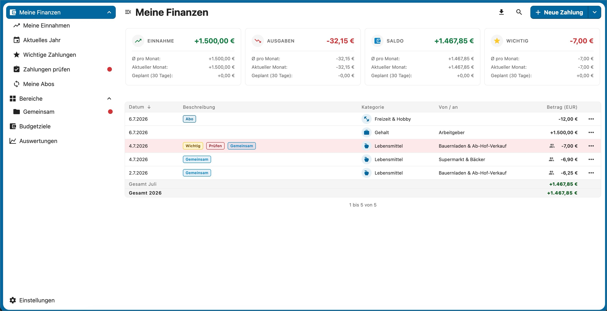
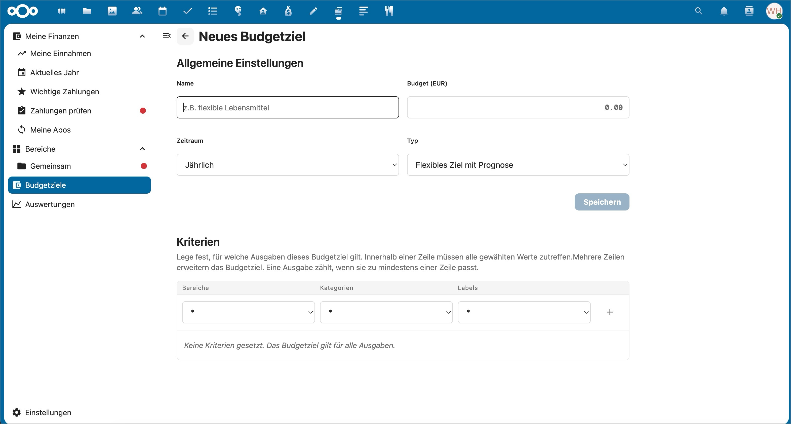
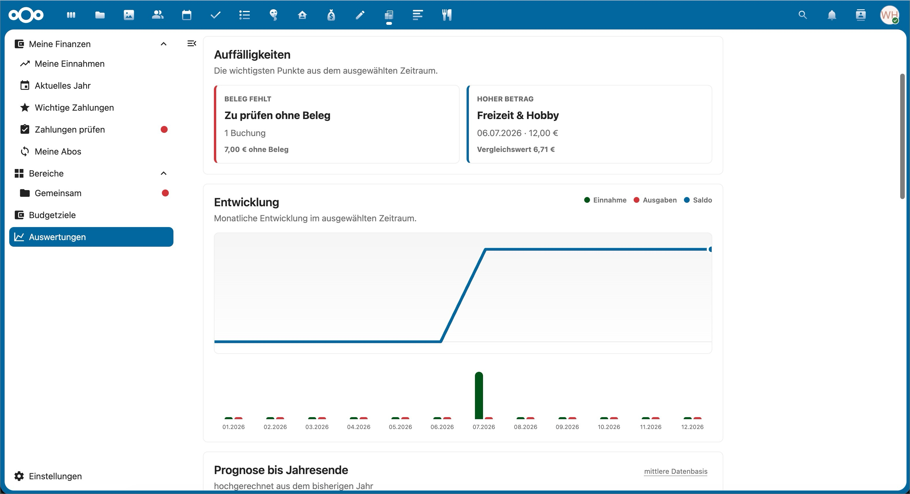
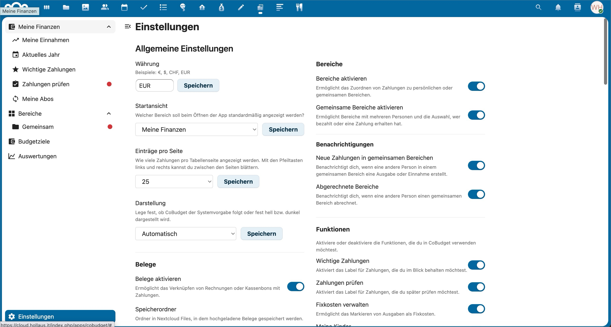

# CoBudget

> [!WARNING]
> CoBudget is an early alpha version. Features, data structures and workflows may still change at any time.
> This is a vibe-coding project, and the codebase has not yet been fully manually reviewed line by line. Use it only with regular backups and do not rely on it as the only source for critical financial records.

CoBudget is a Nextcloud app for personal and shared household budgeting.

It helps you track income, expenses, budgets, receipts and shared areas directly inside your Nextcloud instance. The app is designed for private households, families, couples and small trusted groups who want to understand daily spending, split shared costs and keep their financial data under their own control.

## Project Status

CoBudget is currently in a test phase.

- The app is not yet published in the Nextcloud App Store.
- Public GitHub releases are the first goal.
- App Store publication is planned later.
- Backups are strongly recommended before every update.

## Screenshots

The screenshots below show the current alpha UI and may change during the test phase.









## Features

- Track income and expenses
- Organize payments by categories and payment partners
- Add labels such as important, review, fixed costs, subscriptions, children and tax relevant
- Create shared areas for household costs, trips or other shared budgets
- Split shared area payments by configurable member percentages
- Settle shared areas and keep settlement history
- Attach receipts and invoices stored in Nextcloud Files
- Create reusable payment templates
- Define flexible budget goals
- View analytics for spending, income, trends, labels, areas and budget signals
- Use workspaces to separate independent data pools
- Export payments as CSV
- Create and restore backups
- Support light, dark and system theme modes

See [FEATURES.md](FEATURES.md) for a more detailed overview.

## Requirements

- Nextcloud 27 to 33
- PHP 8.0 or newer
- A user account with access to the CoBudget app
- Browser with modern JavaScript support

## Installation

CoBudget is not available in the Nextcloud App Store yet.

For testing, install a release archive manually:

1. Download the release package.
2. Extract or upload it so the app folder is named `cobudget`.
3. Place it in the Nextcloud `apps/` or `custom_apps/` directory.
4. Enable the app in Nextcloud.

The official release process will later use signed release archives for the Nextcloud App Store.

## Development

Install frontend dependencies:

```sh
npm ci
```

Build production assets:

```sh
npm run build
```

Create the installable Nextcloud ZIP archive:

```sh
npm run release:zip
```

The release ZIP intentionally contains only the runtime app files. Documentation assets such as `screenshots/` are kept in the GitHub repository but are not included in the installable archive.

Run the available test checks:

```sh
npm run test
```

## Release Notes

This project follows semantic versioning as far as practical during the alpha phase.

- Patch releases should contain fixes.
- Minor releases may add or change features.
- Breaking changes are possible during alpha and will be documented in the changelog.

See [CHANGELOG.md](CHANGELOG.md).

## Security

Please report security issues through GitHub Issues for now.

See [SECURITY.md](SECURITY.md) for details.

## License

CoBudget is licensed under the GNU Affero General Public License v3.0 or later.

See [LICENSE](LICENSE).
