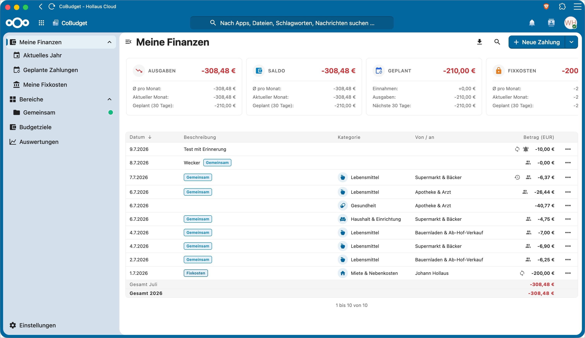
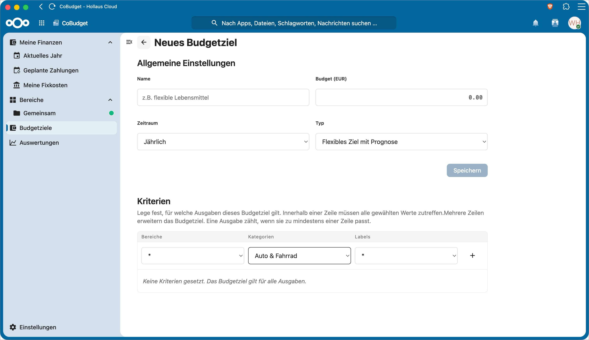
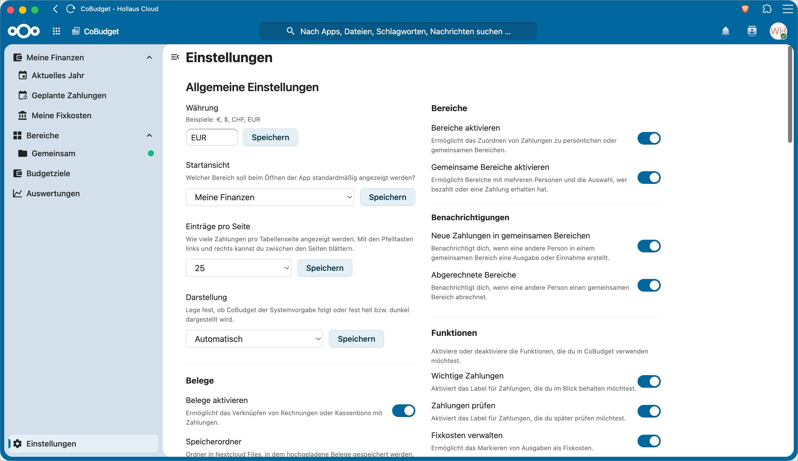

# CoBudget

> [!WARNING]
> CoBudget is an early alpha version. Features, data structures and workflows may still change at any time.
> Development is AI-assisted. The app has automated and targeted security and integrity tests, but it has not been independently audited or fully reviewed line by line. Use it only with regular backups and do not rely on it as the only source for critical financial records.
> During the alpha phase, updates or test data resets may require manual database corrections.

CoBudget is a Nextcloud app for personal and shared household budgeting.

It helps you track income, expenses, budgets, receipts and shared areas directly inside your Nextcloud instance. The app is designed for private households, families, couples and small trusted groups who want to understand daily spending, split shared costs and keep their financial data under their own control.

## Project Status

CoBudget is available in the official [Nextcloud App Store](https://apps.nextcloud.com/apps/cobudget) and remains under active early-alpha development.

- The supported release line is `0.2.x`; see the [changelog](CHANGELOG.md) for the latest changes.
- Nextcloud 33 and 34 are supported.
- App Store releases are signed and mirrored as installable assets on [GitHub Releases](https://github.com/whollaus/cobudget/releases).
- Features, data structures and upgrade behavior may still change before `1.0.0`.
- Backups are strongly recommended before every update, especially for shared areas and restore workflows.
- Bugs and feature requests are tracked through [GitHub Issues](https://github.com/whollaus/cobudget/issues).

## Screenshots

The screenshots below show the current alpha UI and may change during the test phase.








## Features

- Track income and expenses
- Review payment change history with changed fields, previous values and new values
- Organize payments by categories and payment partners
- Add labels such as important, review, fixed costs, subscriptions, children and tax relevant
- Add free-form `#tags` directly in the payment note
- Create shared areas for household costs, trips or other shared budgets
- Use one-member areas as simple personal groupings without balances or settlements
- Add the first additional member only while an area has no personal payments, avoiding ambiguous retroactive splits
- Split shared area payments by configurable member percentages
- Preserve each shared payment's original member split as exact percentages and cents, even when area defaults change later
- Balance indivisible remainder cents cumulatively so the same member is not systematically favored across repeated shared payments
- Materialize every positive member share as a personal payment in that member's Basis workspace
- Keep personal shares synchronized and locked until the area is settled, then release them as independent personal payments with their own exact-value history
- Store a physical receipt copy in each active member's own Nextcloud Files and release those copies at settlement
- Preserve former members and their historical shares when a Nextcloud account is deleted, pause new shared payments until the area is resolved, and retain settled history without keeping a reusable login user ID
- Transfer area ownership manually or automatically to another active member
- Settle shared areas and keep settlement history
- Attach receipts and invoices stored in Nextcloud Files
- Create reusable payment templates
- Define flexible budget goals
- View analytics for spending, income, trends, labels, areas and budget signals
- Use workspaces to separate independent data pools
- Export payments as CSV
- Create personal exports and administrator-owned full backups/restore
- Support light, dark and system theme modes

See [FEATURES.md](FEATURES.md) for a more detailed overview.

## Requirements

- Nextcloud 33 or 34
- PHP 8.0 or newer
- A user account with access to the CoBudget app
- Browser with modern JavaScript support

## Installation

### Nextcloud App Store

Install or update CoBudget from the Apps section of your Nextcloud administration. The official listing is available at [apps.nextcloud.com/apps/cobudget](https://apps.nextcloud.com/apps/cobudget).

Administrators can also install it with OCC:

```sh
occ app:install cobudget
```

### Manual installation

If the App Store is unavailable, install a signed GitHub release manually:

1. Download the `cobudget.tar.gz` asset from [GitHub Releases](https://github.com/whollaus/cobudget/releases).
2. Extract or upload it so the app folder is named `cobudget`.
3. Place it in the Nextcloud `apps/` or `custom_apps/` directory.
4. Enable the app in Nextcloud.

Only the signed `cobudget.tar.gz` release asset is an installable app package. GitHub's automatically generated source archives are repository snapshots and must not be installed as Nextcloud apps.

## Development

Install frontend dependencies:

```sh
npm ci
```

Build production assets:

```sh
npm run build
```

Create an unsigned archive for local development checks:

```sh
npm run release
```

This builds the frontend and creates an unsigned test archive in the workspace root:

- `cobudget.tar.gz` for local packaging checks

The release archive intentionally contains only runtime app files. Documentation assets such as `screenshots/` are kept in the GitHub repository but are not included in installable archives.

Public releases must use the local signed release process described in [RELEASING.md](RELEASING.md).

## GitHub Releases

Regular pushes to `main` only run checks. Pushing a version tag runs all checks and creates a draft prerelease. It intentionally does not publish an unsigned archive.

Before creating a tag, make sure the version matches in:

- `appinfo/info.xml`
- `package.json`
- the tag name, for example `vX.Y.Z`

Release command flow:

```sh
VERSION="$(node -p "require('./package.json').version")"

git add .
git commit -m "Prepare CoBudget $VERSION release"
git push

git tag -a "v$VERSION" -m "CoBudget $VERSION"
git push origin "v$VERSION"
```

After the draft exists, the maintainer builds and signs the final archive locally with the Nextcloud certificate and its matching private key. The signed archive, detached App Store signature, and checksum are uploaded before the draft is published. See [RELEASING.md](RELEASING.md) for the complete procedure.

Run the available test checks:

```sh
npm run test
```

## Release Notes

This project follows semantic versioning as far as practical during the alpha phase.

- Patch releases should contain fixes.
- Minor releases may add or change features.
- Breaking changes are possible during alpha and will be documented in the changelog.

See [CHANGELOG.md](CHANGELOG.md).

## Security

Please report security issues through GitHub Issues for now.

See [SECURITY.md](SECURITY.md) for details.

## Support

If CoBudget helps you, you can support development through [GitHub Sponsors](https://github.com/sponsors/whollaus) or [Stripe](https://donate.stripe.com/aFaeVdfARbPNe897bu5J600).

## License

CoBudget is licensed under the GNU Affero General Public License v3.0 or later.

See [LICENSE](LICENSE).
